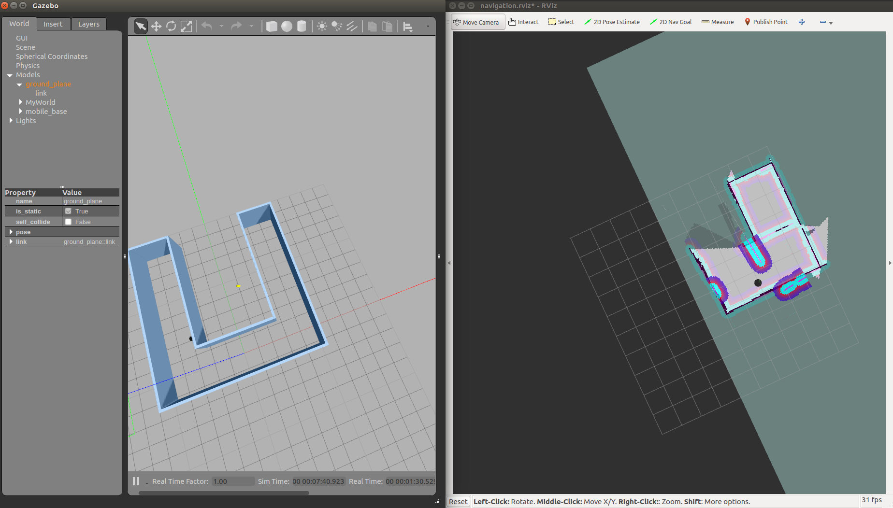

# Home Service Robot


# Shell Scripts

## Test Slam Script
The `test_slam.sh` deploys a turtlebot inside  a environment  and one can control the robot with keyboard commands,
interface it with a SLAM package, and visualize the map in rviz.


## Wall Follower Script
The `wall_follower.sh` automate the process and let the robot follow the walls and autonomously map the environment while avoiding obstacles.

### Wall Follower Algorithm
A Wall Follower Algorithm is a common algorithm that solves mazes. It is also known as the left-hand rule algorithm or the right-hand rule algorithm
depending on which is the priority. The wall follower solve mazes with connected walls, where the robot is guaranteed to reach the exit of the maze
after traversing close to walls.

See the Wall Follower Source code [here](./wall_follower/src/wall_follower.cpp)


## Test Navigation Script

The `test_nagivation.sh` is use to pick different goals and test if the robot can reach them. 

### ROS Navigation Stack
The ROS Navigation stack is used and it is based on the **Dijkstra's**, a variant of the **Uniform Cost Search** algorithm.
The stack permits the robot to avoid any obstacle on its path by replanning a new trajectory once the robot encounters them.


## Pick Objects Script
The `pick_objects.sh` communicates with the ROS navigation stack and autonomously send  successive goals for the robot to reach.
The c++ code  for this node is located [here](./pick_objects/src/pick_objects.cpp)


## Add marker Script
The `add_markers.sh` create a virtual object with markers in rviz. The virtual object is the one being picked and delivered by the robot,thus it appears in its pickup zone,
and then in its drop off zone once the robot reaches it.


## Home Service Script
The `home_service.sh` is a collection of all the scripts put together. It simulate a full home service robot capable of navigating to pick up and deliver a virtual object.


#  Project Setup

## Create a Catkin workspace
```sh
$ mkdir -p ~/catkin_ws/src
$ cd ~/catkin_ws/src
$ catkin_init_workspace

```
## Add Ros Kinetic navigation
```sh
$ sudo apt-get install ros-kinetic-navigation
```

##  Install gmapping
```sh
$ rosdep -i install gmapping
```

## Build
```sh
$ catkin_make
```

## Run Home Service
```sh
$./home_service.sh
```